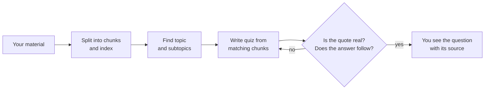

# Grove

Grove turns your own study material into a skill tree you can work through.

You add material — PDFs, slides, notes, YouTube links, and more. Grove reads all of it, finds one main topic with five to seven subtopics, and shows them as a map. Each subtopic has a quiz written from your own sources, and every question shows the exact sentence it came from.

The point is that Grove cannot make things up. Before you see a question, it has to quote a real sentence from your material, and a second AI model has to confirm the answer follows from that sentence. Questions that fail are deleted and rewritten. If none survive, Grove tells you instead of showing you a quiz it cannot back up.

## Running it

```bash
npm install
cp .env.example .env     # add an API key
npm start                # http://localhost:3000
```

Any OpenAI-compatible provider works. `.env.example` has ready-made settings for Groq, Featherless, OpenRouter, and local models through Ollama.

## How it works



Grove reads your files and splits them into small chunks, keeping track of where each one came from. It searches those chunks to find the main topic and its subtopics. For each quiz, it pulls the chunks that match that subtopic and writes questions from them. Then every question is checked twice: once by code, to confirm the quote really appears in the source, and once by a second AI model that sees only that source and has to agree the answer is correct.

A large model writes the tree and the quizzes. A smaller, faster one does the checking, grading, and hints.

## Using it

Getting five out of five completes a subtopic. If you miss one there is no waiting timer — you read the sentences you got wrong, then retry with new questions focused on those. Grove also marks subtopics your material barely covers and tells you what to add. When every subtopic is done, a final quiz opens covering the whole tree. Completed subtopics come back later for review, and you can keep several subjects in separate spaces.

## What it accepts

Files: PDF, Word, PowerPoint, Excel, EPUB, images (read with OCR), text, Markdown, CSV, JSON, HTML, subtitles, code, audio, and video.

Links: YouTube videos and playlists, Wikipedia, arXiv, GitHub, Google Docs, Stack Overflow, Hacker News, RSS feeds, PDF links, and normal articles.

Videos without captions are transcribed automatically.

## Tests

```bash
node scratch/mock.mjs &                     # fake AI server, so no API key is needed
PORT=3111 GROVE_DATA_DIR=/tmp/grove-test \
  LLM_API_KEY=test LLM_BASE_URL=http://localhost:8799/v1 node server/index.js &

node scratch/e2e.mjs        # 30 checks, the full path through the app
node scratch/regress.mjs    # 19 checks, security and edge cases
```

## Deploying

`render.yaml` sets up a Render deployment: New → Blueprint → pick this repo → add your API key. `Dockerfile` and `Procfile` are there for other hosts.

Sessions are stored as files in `data/`. On hosts with temporary storage they are lost when you redeploy, so mount a volume if you want them to last.
