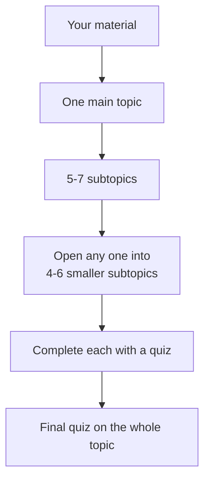

# Grove

Grove turns your own study material into a map you can work through.

You add your material — PDFs, slides, notes, YouTube links, and more. Grove reads all of it and builds a map: one main topic in the middle, with five to seven subtopics around it. Any subtopic can be opened into four to six smaller ones, and it stops there, so the map always stays small enough to actually finish.

Each subtopic is something you complete. You take a short quiz on it, and getting five out of five fills it in. The map shows you where you are at a glance: what is done, what is left, and which parts your material barely covers. When every subtopic is filled in, a final quiz opens on the whole topic.

## Running it

```bash
npm install
cp .env.example .env     # add an API key
npm start                # http://localhost:3000
```

Any OpenAI-compatible provider works. `.env.example` has ready-made settings for Groq, Featherless, OpenRouter, and local models through Ollama.

## The map



Most study tools give you a long list of cards or questions with no shape, so you never know how much is left. Grove gives the material a structure taken from your own sources, and a clear finish line.

The reason there are only two levels to the subtopics is simple. By itself, a topic can be broken down forever, and you end up with hundreds of items and no sense of progress. Two levels keeps a large course to a map you can see in one screen.

Subtopics your material barely covers are marked, and Grove tells you what to add. That way the map reflects what you can actually learn from what you have, instead of quizzing you on gaps.

You can keep several subjects in separate spaces, and completed subtopics come back later for review so they stay learned.

## The quizzes behind it

Each quiz is written from the parts of your material that match that subtopic, and every question shows the exact sentence it came from. Before you see a question, the quote has to really appear in your source, and a second AI model has to confirm the answer follows from it. Questions that fail are rewritten, and if none survive, Grove says so rather than showing you something it cannot back up.

If you miss a question there is no waiting timer. You read the sentences you got wrong, then retry with new questions focused on those.

## What it accepts

Files: PDF, Word, PowerPoint, Excel, EPUB, images (read with OCR), text, Markdown, CSV, JSON, HTML, subtitles, code, audio, and video.

Links: YouTube videos and playlists, Wikipedia, arXiv, GitHub, Google Docs, Stack Overflow, Hacker News, RSS feeds, PDF links, and normal articles.

Videos without captions are transcribed automatically.

## Tests

```bash
node scratch/mock.mjs &                     # fake AI server, so no API key is needed
PORT=3111 GROVE_DATA_DIR=/tmp/grove-test \
  LLM_API_KEY=test LLM_BASE_URL=http://localhost:8799/v1 node server/index.js &

node scratch/e2e.mjs        # 30 checks, the full path through the app
node scratch/regress.mjs    # 19 checks, security and edge cases
```

## Deploying

`render.yaml` sets up a Render deployment: New → Blueprint → pick this repo → add your API key. `Dockerfile` and `Procfile` are there for other hosts.

Sessions are stored as files in `data/`. On hosts with temporary storage they are lost when you redeploy, so mount a volume if you want them to last.
